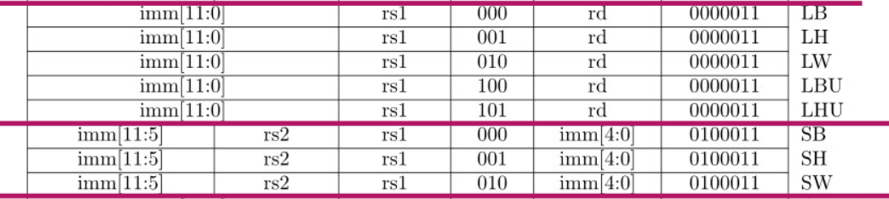
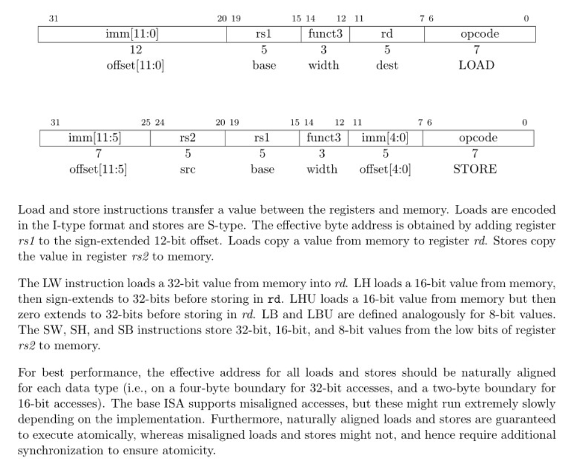

This FPGA test is about implementing load and store instruction.

Execute a single store or load instruction of one byte repeatedly, showing the results on FPGA leds. 

The main difficulty is that our ram is one-way accessible. We need to stall IF module's instruction fetching in order to do memory accessing. 

The idea of MEM module is basically the same as IF module. 

In this experiment, implement LH first. 