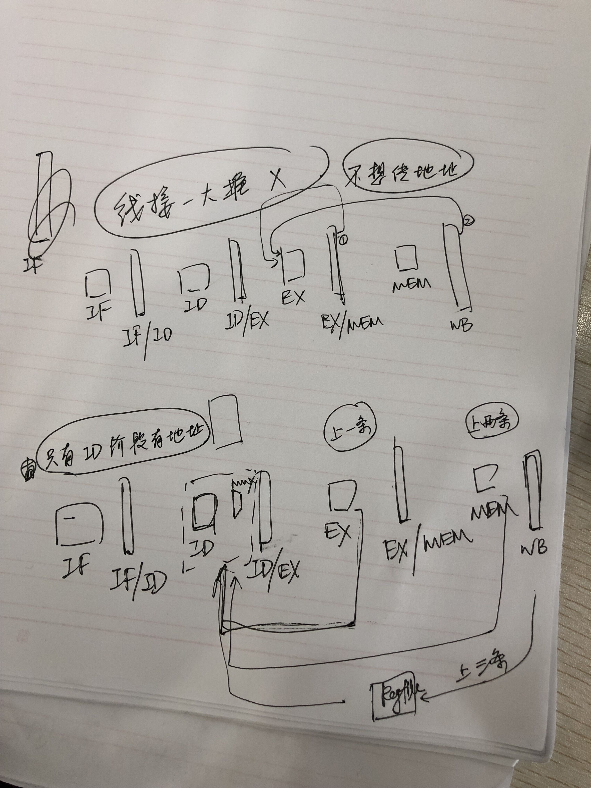

In this simulation, a 'stall-regulator' is added, which controls all the buffers, so that the pipeline can be stalled during various kinds of hazards. 

Let's play with data-hazard. No forwarding is implemented but add dirty bit to registerfiles. 

When I consider solving data-hazard using forwarding, I soon get upset because data meanings and formats vary so much. I feel that it's impossible because of the scale of cases and comparison needed in all stages. However, the key is to grab the invariance -- concrete format is useless, the 'match' between data and address is the most important. 
When data gets stored into ID/EX, then nothing could help. So, we had better let it choose, namely: 
  EX -> ID/EX; MEM -> ID/EX; MEM/WB -> ID/EX. 

Forwarding without MEM access is implemented EX/MEM -> EX; WB -> EX. Thus add some ports to these modules.

Note that the one-hop ahead instruction is forwarded from EX, the second is MEM, the third is directly from REGFILE. But if the one-hope ahead instruction is a MEM load instruction, then the result isn't prepared, which results in PIPELINE STALL. Note that the output forwarding signals need no extra ports (just add ports in ID module).

OK, addi_forwarding test has been passed. The next thing is to deal with LOAD data hazard. The situation is as follows. Data hazard happens in ID phase, because it is then when we will have to fetch data from registerfile. The only case that cannot be solved by forwarding is 'one-hop-before LD instruction', which should be at EX phase, hasn't got memory data yet. Thus the communication between ID and EX phase is needed. EX's aluop is passed to ID so that ID can monitor this situation. Note that the LOAD destination has already been given. 

Good News! My CPU is able to STORE AND LOAD correctly. I misunderstood the 'immediate encoding' of STORE instruction, which leads to false address decoding. But my arithemetic after LOAD is incorrect, this may result from failing to stall. 